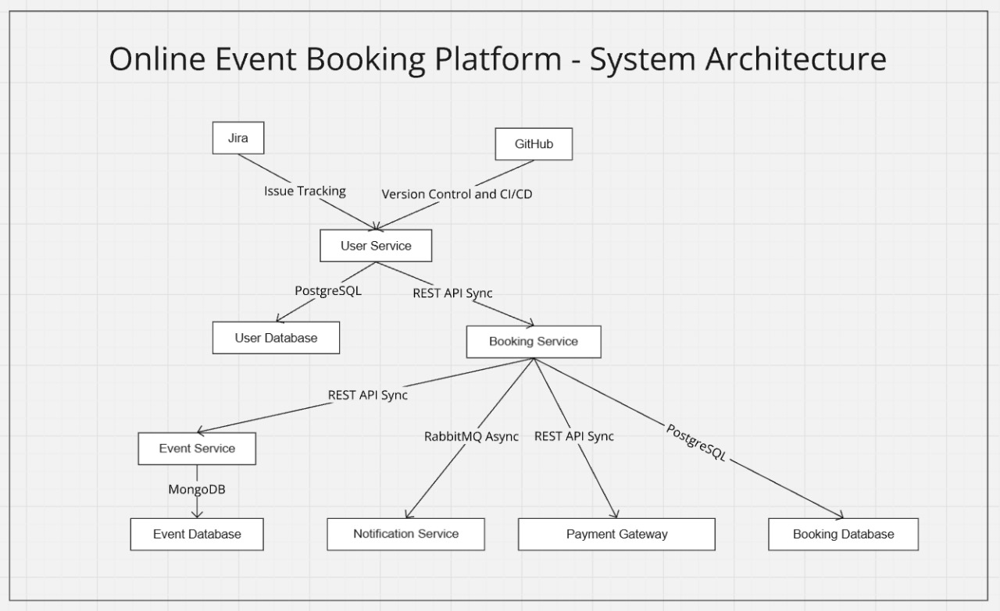

# Online Event Booking Platform

This project implements an **Online Event Booking Platform** using a **microservices architecture**. It allows users to browse events, book tickets, and receive notifications. The project is divided into several microservices, each responsible for a specific part of the functionality.

---

## Table of Contents

- [Project Overview](#project-overview)
- [Microservices Architecture](#microservices-architecture)
- [System Architecture Diagram](#system-architecture-diagram)
- [API Documentation](#api-documentation)
  - [User Service](#user-service)
  - [Event Service](#event-service)
  - [Booking Service](#booking-service)
  - [Notification Service](#notification-service)
  - [Payment Service](#payment-service)

---

## Project Overview

The Online Event Booking Platform provides the following key functionalities:

- **User Management:** Registration, authentication, and profile management.
- **Event Management:** Creation and retrieval of event details and availability.
- **Booking Management:** Booking creation, ticket reservations, and payment processing.
- **Notification:** Sending confirmation notifications (via email/SMS) upon successful bookings.
- **Payment Processing:** Handling payment transactions for ticket bookings.

---

## Microservices Architecture

This platform is built as a set of independent services communicating via REST APIs and asynchronous messaging (using RabbitMQ where applicable). The main microservices are:

1. **User Service:** Manages user data and authentication.
2. **Event Service:** Manages event listings, details, and availability.
3. **Booking Service:** Processes ticket bookings and interacts with payment and notification systems.
4. **Notification Service:** Sends booking confirmation notifications.
5. **Payment Service:** Handles the processing of payments.

Each microservice follows best practices in error handling, logging, and secure environment configuration.

---

## System Architecture Diagram


--- 

## API Documentation

Below are the API specifications for each microservice. These endpoints serve as examples; consult your actual service code for any adjustments.

### User Service

**Base URL:** `/users`

- **Register User**
  - **Endpoint:** `POST /signup`
  - **Description:** Registers a new user.
  - **Request Body:**
    ```json
    {
      "username": "string",
      "password": "string"
    }
    ```
  - **Responses:**
    - `201 Created` – User registered successfully.
    - `400 Bad Request` – Invalid input data.

- **User Login**
  - **Endpoint:** `POST /login`
  - **Description:** Authenticates a user and returns a JWT token.
  - **Request Body:**
    ```json
    {
      "username": "string",
      "password": "string"
    }
    ```
  - **Responses:**
    - `200 OK` – Returns a JWT token.
    - `401 Unauthorized` – Invalid credentials.
---

### Event Service

**Base URL:** `/events`

- **Create Event**
  - **Endpoint:** `POST /events`
  - **Description:** Creates a new event.
  - **Request Body:**
    ```json
    {
      "title": "string",
      "description": "string",
      "date": "YYYY-MM-DD",
      "location": "string",
      "available_tickets": "integer"
    }
    ```
  - **Responses:**
    - `201 Created` – Event created successfully.
    - `400 Bad Request` – Invalid event data.

- **Get All Events**
  - **Endpoint:** `GET /events`
  - **Description:** Retrieves a list of all available events.
  - **Responses:**
    - `200 OK` – Returns an array of event objects.

- **Get Event by ID**
  - **Endpoint:** `GET /events/{id}`
  - **Description:** Retrieves details for a specific event.
  - **Responses:**
    - `200 OK` – Returns event details.
    - `404 Not Found` – Event not found.

- **Check Event Availability**
  - **Endpoint:** `GET /events/{id}/availability`
  - **Description:** Checks the available ticket count for a specific event.
  - **Responses:**
    - `200 OK` – Returns availability details.
    - `404 Not Found` – Event not found.

---

### Booking Service

**Base URL:** `/bookings`

- **Create Booking**
  - **Endpoint:** `POST /bookings`
  - **Description:** Creates a new booking for an event.
  - **Request Body:**
    ```json
    {
      "user_id": "string",
      "event_id": "string",
      "number_of_tickets": "integer",
    }
    ```
  - **Responses:**
    - `201 Created` – Booking successfully created.
    - `400 Bad Request` – Invalid booking details.
    - `402 Payment Required` – Payment failed.

- **Confirm Booking**
  - **Endpoint:** `POST /bookings/confirm`
  - **Description:** Retrieves booking details by booking ID.
  - **Request Body:**
    ```json
    {
      "booking_id": "string",
      "amount": "integer",
      "account_id": "integer",
    }
    ```
  - **Responses:**
    - `200 OK` – Returns booking details.
    - `404 Not Found` – Booking does not exist.

---

### Notification Service

**Base URL:** `/notifications`

- **Send Notification**
  - **Endpoint:** `POST /notifications`
  - **Description:** Sends a notification (email/SMS) after a booking is confirmed.
  - **Request Body:**
    ```json
    {
      "user_id": "string",
      "booking_id": "string",
      "message": "string"
    }
    ```
  - **Responses:**
    - `200 OK` – Notification sent successfully.
    - `400 Bad Request` – Invalid request data.

---

### Payment Service

**Base URL:** `/payments`

- **Process Payment**
  - **Endpoint:** `POST /payments`
  - **Description:** Processes the payment for a booking.
  - **Request Body:**
    ```json
    {
      "booking_id": "string",
      "amount": "number",
      "account_id": "number"
    }
    ```
  - **Responses:**
    - `200 OK` – Payment processed successfully.
    - `402 Payment Required` – Payment processing failed.
---
# Commands to setup ingress: 
  - helm install nginx-ingress ingress-nginx/ingress-nginx   --namespace ingress-nginx   --create-namespace   --set controller.service.type=NodePort   --set controller.service.nodePorts.http=32080   --set controller.service.nodePorts.https=32443     

  - kubectl port-forward -n ingress-nginx service/nginx-ingress-ingress-nginx-controller 8080:80


